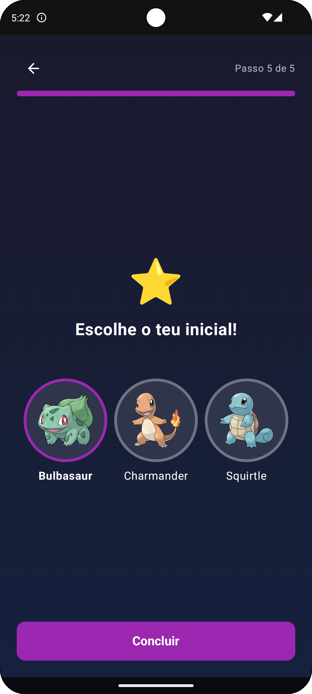
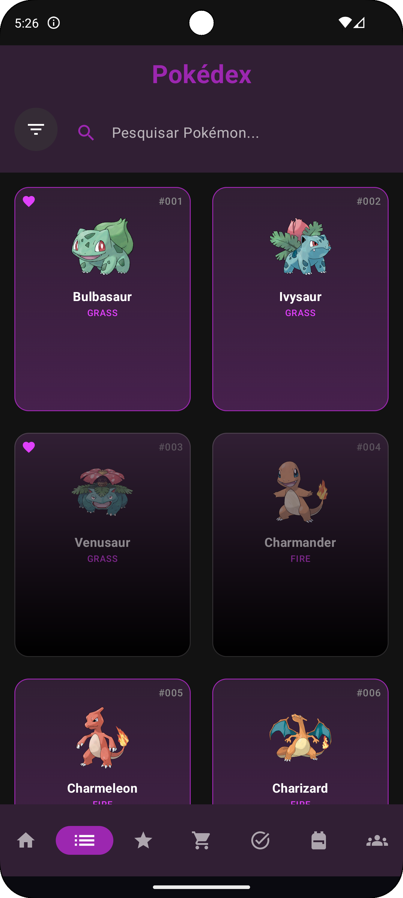
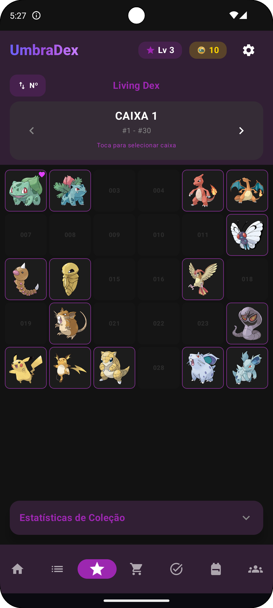

# UmbraDex 🐾

A gamified Pokédex Android application that brings the Pokémon collecting experience to mobile devices with a dark, immersive theme. Built with modern Android technologies and powered by Supabase backend.

## 🌟 Features

### Core Functionality
- **Complete Pokédex**: Browse all Pokémon from Generation 1-9 with detailed information
- **Living Dex Tracker**: Track your collection progress with visual indicators
- **Team Builder**: Create and manage up to 22 teams of 6 Pokémon each
- **Achievement System**: 200+ progressive missions with rewards
- **Customization Shop**: Purchase themes, avatars, badges, and name colors
- **Interactive Pet**: Mobile companion Pokémon that responds to touch

### Gamification Elements
- **Level Progression**: Reach level 100 with XP rewards
- **Economy System**: Earn gold through missions and level-ups
- **Rarity Tiers**: Common, Rare, Epic, and Legendary items
- **Statistics Dashboard**: Track collection progress and playtime
- **Favorites System**: Mark and equip favorite Pokémon

### User Experience
- **Onboarding Flow**: Interactive questionnaire for new users
- **Dark Theme**: Purple-accented UI with visual polish
- **Smooth Animations**: Transitions and interactive elements
- **Offline Support**: Cached data for offline browsing

## 🛠️ Technology Stack

### Frontend
- **Language**: Kotlin
- **UI Framework**: Jetpack Compose
- **Architecture**: MVVM with Repository Pattern
- **Navigation**: Compose Navigation
- **Charts**: Vico Compose Charts

### Backend & APIs
- **Database**: PostgreSQL via Supabase
- **Authentication**: Supabase Auth
- **External API**: PokéAPI (via Retrofit)
- **Image Loading**: Coil
- **Real-time**: Supabase Realtime

### Development Tools
- **IDE**: Android Studio
- **Build System**: Gradle (Kotlin DSL)
- **Version Control**: Git
- **Package Manager**: Gradle with Version Catalogs

## 📱 Screenshots

<p align="center">
  
  
  
</p>

## 🚀 Getting Started

### Prerequisites
- **Android Studio**: Arctic Fox or later
- **Minimum SDK**: API 24 (Android 7.0)
- **Target SDK**: API 36 (Android 16)
- **Java Version**: 17

### Installation

1. **Clone the repository**
   ```bash
   git clone https://github.com/Robim5/UmbraDex.git
   cd UmbraDex
   ```

2. **Open in Android Studio**
   - Launch Android Studio
   - Select "Open an existing Android Studio project"
   - Navigate to the cloned directory and select it

3. **Configure Supabase**
   - Create a new project at [Supabase](https://supabase.com)
   - Copy your project URL and anon key
   - Add them to `local.properties`:
     ```
     SUPABASE_URL=your_supabase_url
     SUPABASE_ANON_KEY=your_anon_key
     ```

4. **Set up the Database**
   - Run the SQL scripts in the `databaseitems.sql` file
   - Execute migrations in the `migrations/` folder in order

5. **Build and Run**
   - Click the "Run" button in Android Studio
   - Select a device or emulator
   - The app will install and launch automatically

### Database Setup

The app uses a comprehensive PostgreSQL schema managed through Supabase. Key tables include:

- `profiles`: User profiles with game stats
- `pokemon`: Pokémon data cache
- `missions`: Achievement definitions
- `user_missions`: User progress tracking
- `items`: Shop items and inventory
- `teams`: User-created Pokémon teams

Run the provided SQL scripts to initialize the database structure.

## 🏗️ Project Structure

```
app/src/main/java/com/umbra/umbradex/
├── data/
│   ├── api/          # External API clients (PokéAPI)
│   ├── cache/        # Data caching layer
│   ├── model/        # Data models and DTOs
│   ├── repository/   # Repository layer
│   └── supabase/     # Supabase client configuration
├── ui/
│   ├── auth/         # Authentication screens
│   ├── components/   # Reusable UI components
│   ├── home/         # Start page and dashboard
│   ├── pokedex/      # Pokédex browsing
│   ├── pokelive/     # Living Dex tracker
│   ├── shop/         # Item purchase interface
│   ├── missions/     # Achievement system
│   ├── inventory/    # Item management
│   ├── teams/        # Team builder
│   ├── settings/     # App settings
│   ├── navigation/   # Navigation components
│   └── theme/        # App theming
├── utils/            # Utility functions
├── MainActivity.kt   # App entry point
├── MainViewModel.kt  # Main app state
└── UmbraDexApplication.kt
```

## 🎮 Game Mechanics

### Progression System
- **Levels**: 1-100 with increasing XP requirements
- **XP Sources**: Mission completion, adding Pokémon to collection
- **Gold Rewards**: Mission completion, level milestones

### Mission Categories
- Collection (Pokémon capture progress)
- Favorites (Managing favorite Pokémon)
- Teams (Team creation and management)
- Shop (Purchasing items)
- Personalization (Profile customization)
- Exploration (General achievements)

### Economy
- **Gold**: Earned through missions and levels
- **Shop Items**: Themes, avatars, badges, name colors
- **Rarity Pricing**: Common (300g) → Legendary (3500g)

## 🔧 Development

### Building
```bash
./gradlew assembleDebug  # Debug build
./gradlew assembleRelease  # Release build
```

### Testing
```bash
./gradlew test            # Unit tests
./gradlew connectedTest   # Instrumented tests
```

### Code Style
The project follows Kotlin coding conventions and uses:
- Detekt for static analysis
- Ktlint for code formatting
- Compose preview annotations for UI development

## 📊 Database Schema

The application uses a normalized PostgreSQL schema with:
- **Row Level Security**: Supabase RLS policies
- **Triggers**: Automatic progress updates
- **Stored Procedures**: Complex business logic
- **Views**: Optimized data access

See `UmbraDex_Database_Schema.md` for complete documentation.

## 🤝 Contributing

1. Fork the repository
2. Create a feature branch (`git checkout -b feature/amazing-feature`)
3. Commit your changes (`git commit -m 'Add amazing feature'`)
4. Push to the branch (`git push origin feature/amazing-feature`)
5. Open a Pull Request

### Code Guidelines
- Follow MVVM architecture patterns
- Use Compose for all new UI components
- Write unit tests for business logic
- Update documentation for API changes

## 📝 Documentation

- [Complete Feature Documentation](UmbraDex_Documentation.md)
- [Database Schema](UmbraDex_Database_Schema.md)
- [Mission System Details](migrations/README_MISSIONS_FIX.md)

## 📄 License

This project is licensed under the MIT License - see the [LICENSE](LICENSE) file for details.

## 🙏 Acknowledgments

- **Pokémon Data**: Powered by [PokéAPI](https://pokeapi.co/)
- **Backend**: [Supabase](https://supabase.com/)
- **Icons**: Custom designed for UmbraDex
- **Inspiration**: Classic Pokédex applications

## 📞 Support

For support, join our Discord community.

---

**UmbraDex** - Where shadows meet adventure! 🌑⚡
